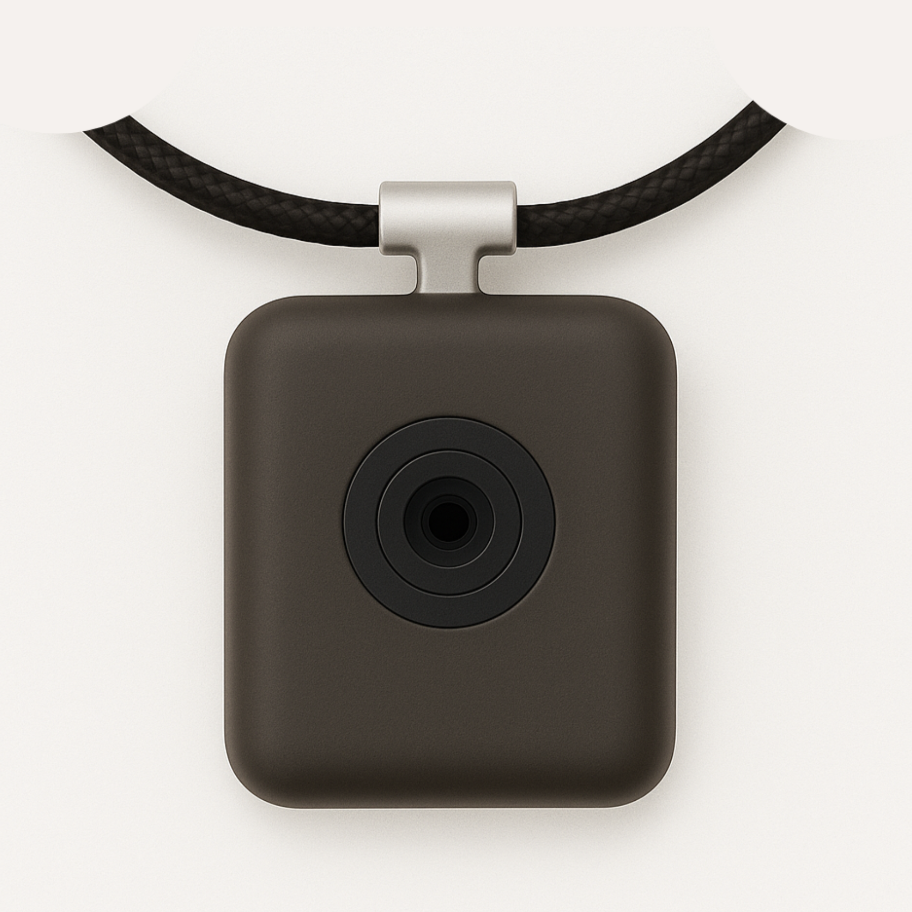

<div style="height: 100vh; display: flex; flex-direction: column; position: relative;">
  <div style="position: absolute; top: 0; left: 0; font-size: 32px; font-weight: bold;">
    株式会社Universal Pine
  </div>
  <div style="flex: 1; display: flex; justify-content: center; align-items: center;">
    <div style="text-align: center;">
      <div style="font-size: 32px; margin-bottom: 20px;">ミッション</div>
      <div style="font-size: 72px; font-weight: bold;">「人々の生活をより良くする」</div>
    </div>
  </div>
</div>

<div style="page-break-after: always;"></div>

<div style="height: 100vh; display: flex; flex-direction: column; position: relative;">
  <div style="flex: 1; display: flex; justify-content: center; align-items: center;">
    <div style="text-align: center;">
      <div style="font-size: 32px; margin-bottom: 20px;">やっていること</div>
      <div style="font-size: 32px; font-weight: bold; margin-bottom: 40px;">ハードとソフトを統合したAIネックレスを開発</div>
      <div style="margin-top: 30px;">
        
      </div>
      <div style="font-size: 24px; margin-top: 20px;">AIネックレス - 音声で操作できるウェアラブルデバイス</div>
    </div>
  </div>
</div>

<div style="page-break-after: always;"></div>

## 主な機能

| 機能 | 説明 |
|------|------|
| 🎤 音声会話 | 音声でAIに指示・質問し自然な会話が可能 |
| 🔍 情報検索 | 知りたいことをすぐに音声で回答 |
| 📝 メモ・リマインダー | 声で記録、必要なときに通知 |

### ターゲットユーザー
- 一般消費者
- 日常的にAIを活用したい方
- ハンズフリーで情報にアクセスしたい方

---

## 開発状況

### 現在のステータス

```
[████████████░░░░░░░░] 60% - 開発中
```

| フェーズ | 状況 | 時期 |
|---------|------|------|
| 企画・設計 | ✅ 完了 | 2025年 |
| プロトタイプ開発 | ✅ 完了 | 2025年 |
| 製品開発・テスト | 🔄 進行中 | 2025年〜2026年 |
| 量産準備 | ⏳ 予定 | 2026年前半 |
| **販売開始** | 📅 予定 | **2026年6月** |

---

## 今後の展望・ロードマップ

### 2026年

| 時期 | マイルストーン |
|------|---------------|
| 1〜3月 | 最終テスト・品質検証 |
| 4〜5月 | 量産開始・販売準備 |
| **6月** | **製品販売開始（予定）** |
| 7月〜 | ユーザーフィードバック収集・改善 |

---

## 製品の強み

1. **自然な装着感**
   - アクセサリーとして違和感のないデザイン
   - 軽量で長時間の使用が可能

2. **プライバシー配慮**
   - 必要なときだけ起動する設計
   - データの安全な管理

3. **シンプルな操作性**
   - 複雑な設定不要
   - 話しかけるだけで使える

---

## 会社概要

| 項目 | 内容 |
|------|------|
| 会社名 | 株式会社Universal Pine |
| 代表取締役 | 船橋穂天 |
| 所在地 | 東京都世田谷区下馬1-19-5 |
| Webサイト | https://universalpine.com |

---

## お問い合わせ

**株式会社Universal Pine**
- Web: https://universalpine.com
- mail: ho@universalpine.com


